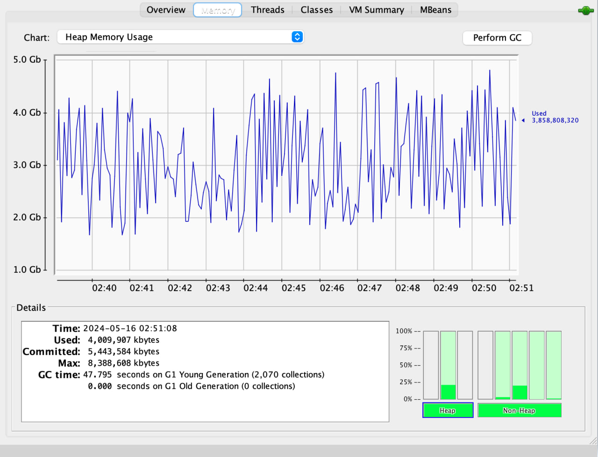
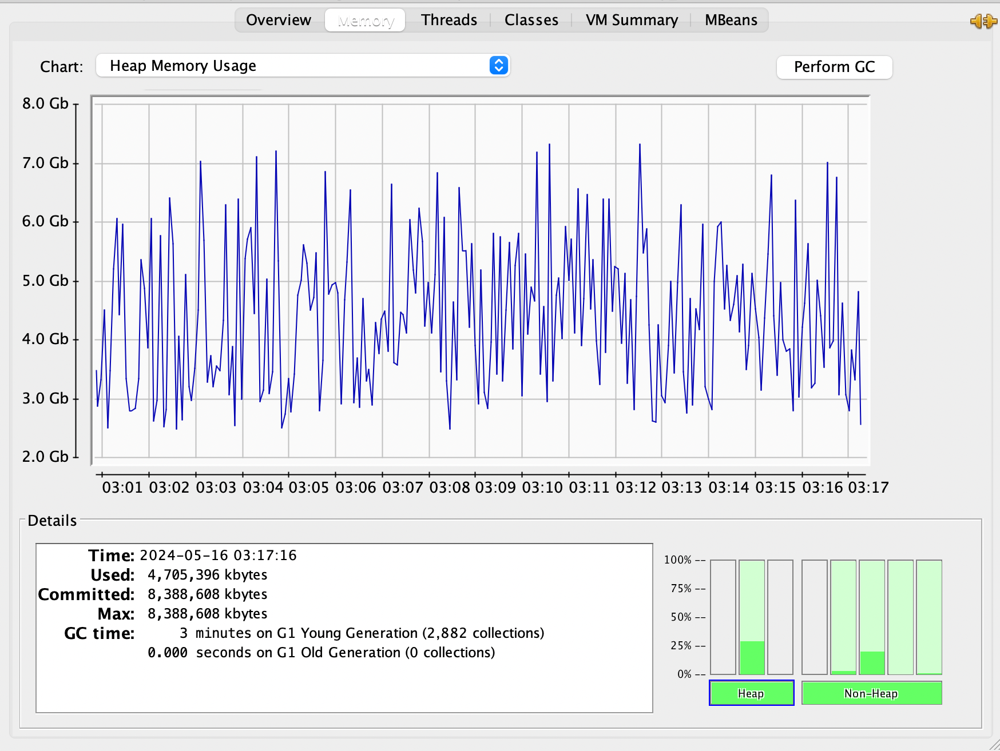

# Unique IPs Counter

This is my implementation of test task for Ecwid: https://github.com/Ecwid/new-job/blob/master/IP-Addr-Counter.md

Service optimized specifically for large files (Tested on 120Gb file)

**To launch the app do the following**:

1. export JAVA_HOME=your_java_17_path
2. mvn clean package -DskipTests
3. java -jar target/ip-counter-1.0.jar you_ips_file_path

Here is some benchmarks and metrics:

The best result I could get on reading 120Gb file so far is **12.9 minutes** on my machine (MacBook Pro M1/32GB)

## Things that impacted performance the most:

1. **Amount of threads**
   Even though file is being read in a single thread (which is the slowest and heaviest operation in the service overall),
   and relatively 'light' operation of handling file chunks is pushed onto thread pool queue, still increasing amount of 
   threads handling those light tasks can decrease computation time almost by a factor of **two** 
   (started from 10 threads, increased to 20, doesn't make sense to increase it further on ny machine)

2. **Buffer size**
   I read the file in chunks using buffer, which size impacts performance in non-linear way:
   2Mb buffer performed better than 1Mb, but increasing it to 10Mb made things much worse in terms of not only space, but time
   

3. **Amount of buckets in ConcurrentBitSet**
   I slightly modified standard version of BitSet (see ConcurrentBitSet) to store larger set of IPs and use it in multithread env.
   To synch the access I used 'concurrent' approach (instead of 'synchronized') where only specific bucket gets locked on write;
   When amount of buckets was increased from 3 to 20 (the same as amount of thread), performance increased significantly 
   (from ~30 mins to ~18 mins).

## Things that didn't matter:

1. **Parallel reading of file**
   At first I tried not only handle file chunks, but also read them in multiple threads, spreading offsets across them; 
   In fact, it didn't matter whether I read file in many threads, or just in one, performance was the same, but code for parallel reading 
   was complex and almost impossible to debug on large files, that is why I chose 'producer->consumers' patterns where file is read only
   by one thread

